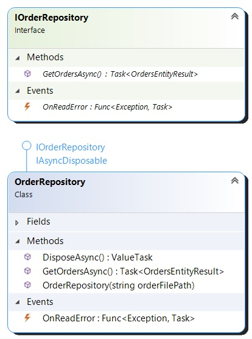
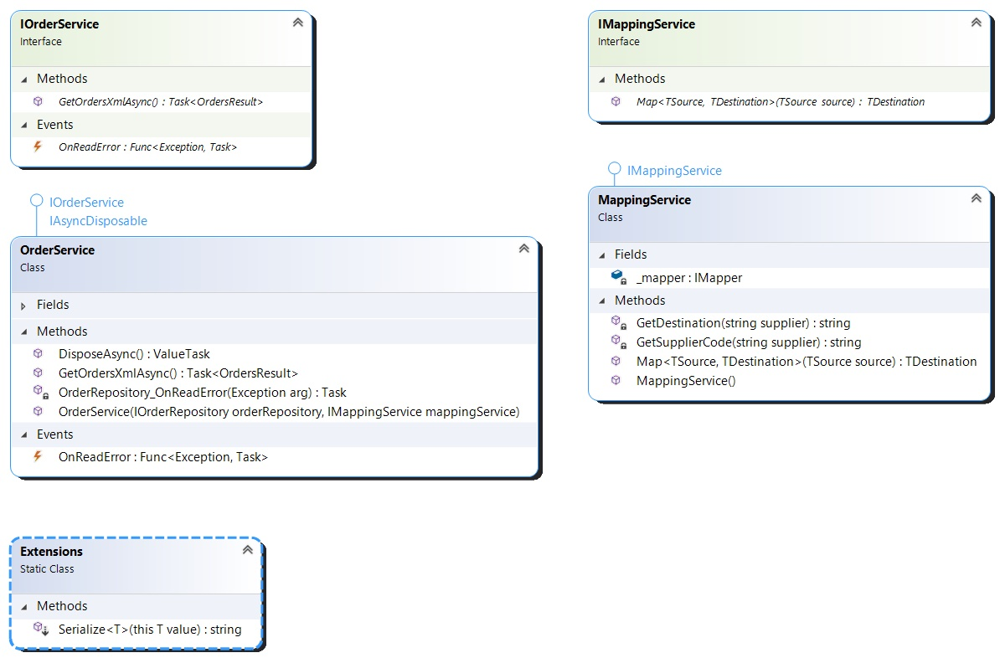
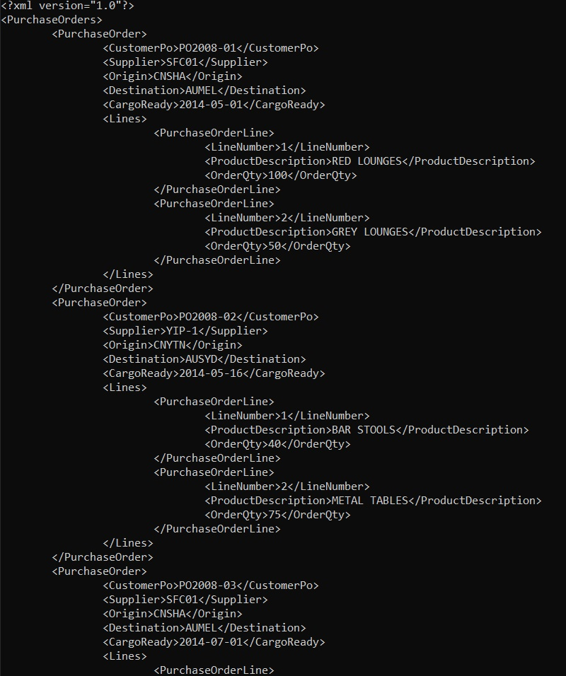

# MondialeVGL coding challenge

The solution is a .Net Core Console app.

### Tech stack

* .Net Core 5.0 Console app
* CsvHelper 27.2.1
* Automapper 10.1.1

### The application layers

* Repository
* Service
* Application

## Repository

There are various Entities in this layer.
These entities model the input data in the csv file.

The **OrderRepository** reads the csv file using **CsvHelper**.

## Service

The **OrderService** calls the repository to read the orders.

Then, it maps the Entities to the Models using **Automapper**.

The Models are set up with xml serialization attributes.

Then, it serializes the model to xml using **XmlSerializer**.

## Application

The application is a .Net Core Console app.

It sets up the Repository, Services for **dependency injection**.

It calls into the **OrderService** to transform the csv file into xml.

